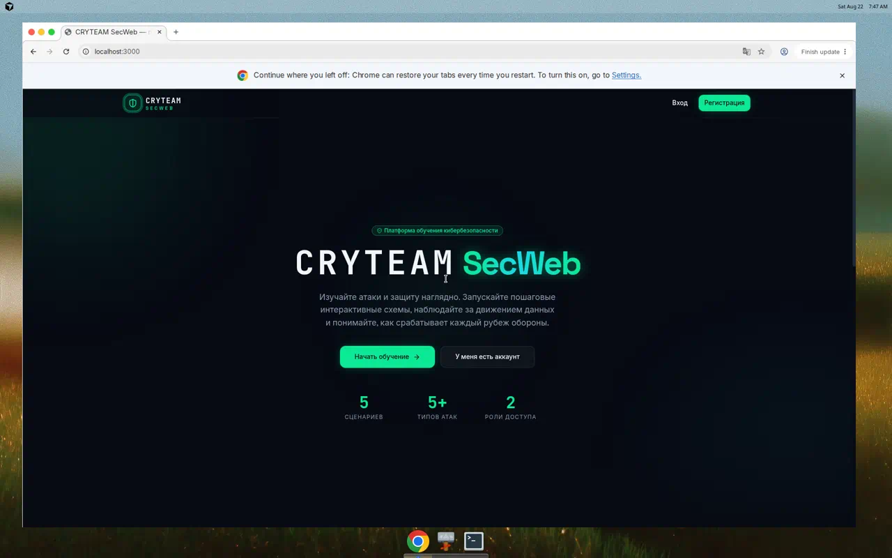
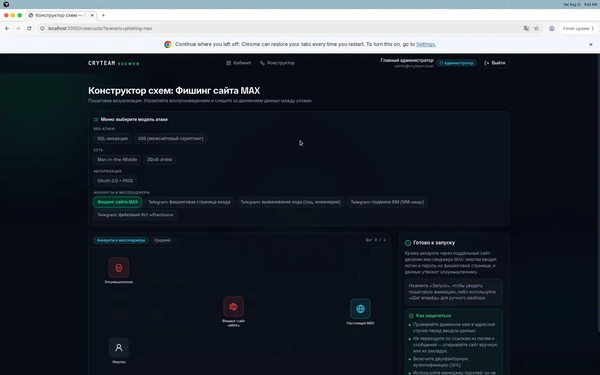
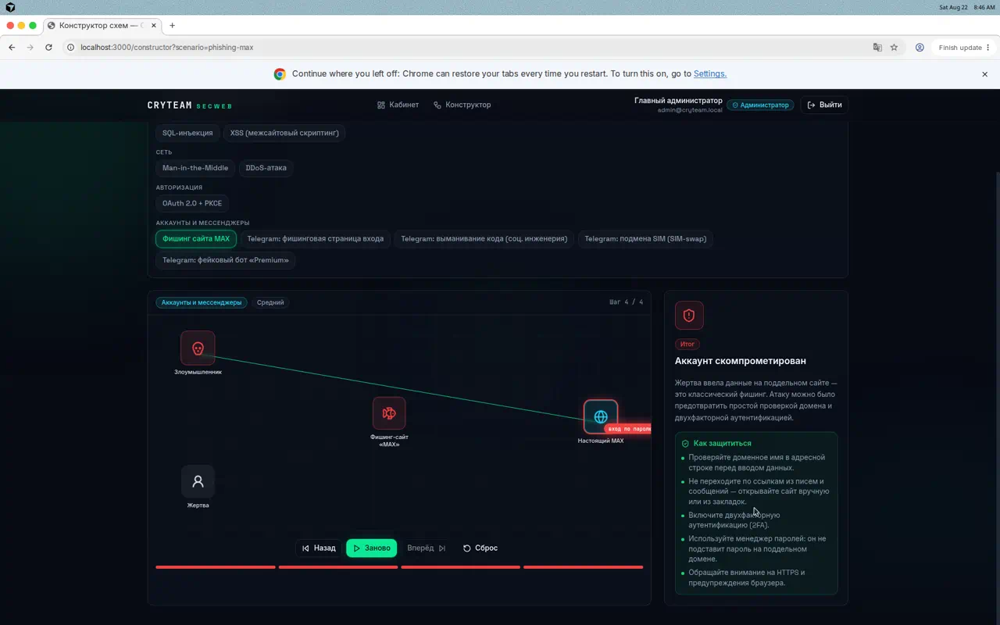
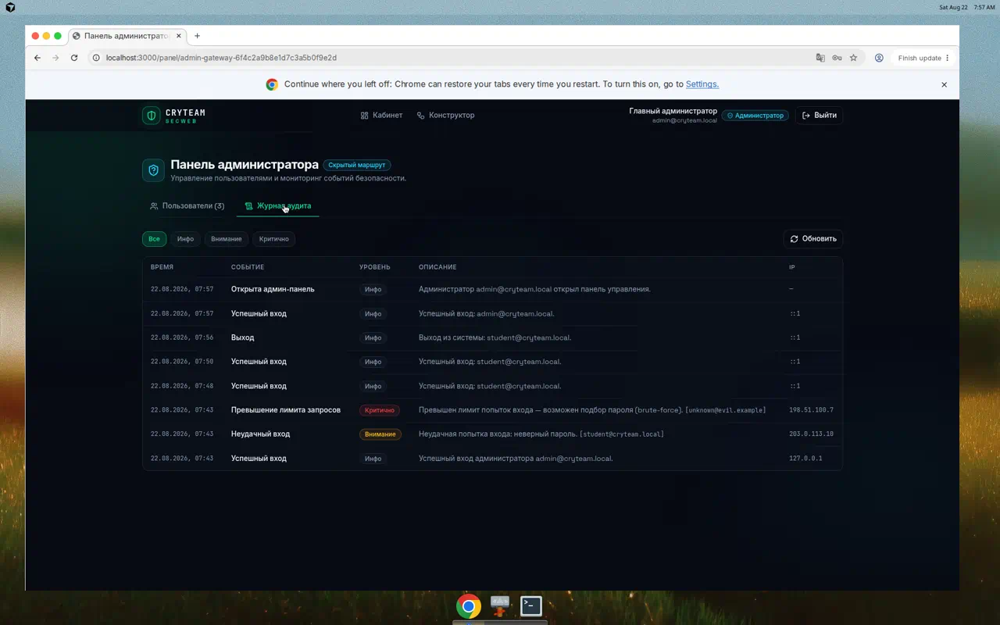

<div align="center">

# CRYTEAM SecWeb

**Курсы и рекомендации по кибербезопасности**
Пошаговая визуализация атак и защиты, курсы, интерактивные схемы, песочница и уроки.

[](https://github.com/Yaroslavtatar/Cryteam-SecWeb/actions/workflows/ci.yml)
[](https://nextjs.org/)
[](https://www.typescriptlang.org/)
[](https://www.prisma.io/)
[](https://www.sqlite.org/)
[](https://tailwindcss.com/)
[](https://vitest.dev/)
[](LICENSE)

</div>

---

## Содержание

- [О проекте](#о-проекте)
- [Скриншоты](#скриншоты)
- [Ключевые возможности](#ключевые-возможности)
- [Технологический стек](#технологический-стек)
- [Архитектура и безопасность](#архитектура-и-безопасность)
- [Структура проекта](#структура-проекта)
- [Быстрый старт (локально)](#быстрый-старт-локально)
- [Переменные окружения](#переменные-окружения)
- [Скрипты npm](#скрипты-npm)
- [Тестирование](#тестирование)
- [Развёртывание в Docker / Coolify](#развёртывание-в-docker--coolify)
- [Роли и демо-доступы](#роли-и-демо-доступы)
- [Сценарии кибербезопасности](#сценарии-кибербезопасности)
- [Лицензия](#лицензия)

---

## О проекте

**CRYTEAM SecWeb** — это курсы и рекомендации по кибербезопасности, которые наглядно
показывают, как работают популярные атаки и как от них защищаться. В основе — интерактивный конструктор схем:
пользователь пошагово запускает анимацию движения данных между узлами (клиент → WAF →
сервер → БД и т.п.), видит понятные описания каждого шага и итоговое состояние
(«атака заблокирована» или «аккаунт скомпрометирован»), а также блок **«Как защититься»**.

Весь интерфейс, уведомления, роли и учебные материалы — **на русском языке**.
Брендинг — только текстовый, без графических логотипов.

## Скриншоты

| Главная | Конструктор схем (меню атак) |
| --- | --- |
|  |  |

| Фишинг сайта MAX (итог + «Как защититься») | Админ-панель: журнал аудита |
| --- | --- |
|  |  |

## Ключевые возможности

- **Интерактивный конструктор схем** — анимация пакетов (Framer Motion), кнопки
  «Запуск / Пауза / Шаг вперёд / Шаг назад / Сброс», описания шагов и итог.
- **Меню выбора модели атаки**, сгруппированное по категориям.
- **10 готовых сценариев**: веб-атаки, сеть, авторизация и методы взлома аккаунтов
  (фишинг сайта MAX, взлом Telegram) с рекомендациями «как избегать».
- **Роли** `ADMIN` / `STUDENT` с разграничением доступа.
- **Личный кабинет** ученика с прогрессом по модулям.
- **Скрытая админ-панель** по секретному хеш-маршруту: управление пользователями
  (роли, блокировка) и журнал аудита безопасности.
- **Защищённый API-шлюз**: JWT в HttpOnly-cookie, rate limiting, CSRF, security-заголовки.

## Технологический стек

| Слой | Технологии |
| --- | --- |
| **Фронтенд** | Next.js 14 (App Router), React 18, TypeScript 5 |
| **Стилизация / анимация** | TailwindCSS 3, Framer Motion, Lucide Icons, UI в стиле shadcn |
| **Бэкенд** | Next.js Route Handlers (Node.js) |
| **База данных / ORM** | SQLite + Prisma ORM 5 |
| **Авторизация** | JWT (`jose`) в HttpOnly-cookie, хеширование `bcryptjs` |
| **Валидация** | Zod (сообщения на русском) |
| **Тесты** | Vitest |
| **CI/CD** | GitHub Actions |
| **Деплой** | Docker (multi-stage), Coolify (docker-compose) |

## Архитектура и безопасность

API реализует «шлюз безопасности» со следующими механизмами:

- **JWT-сессии** — пара access + refresh токенов в защищённых `HttpOnly` cookie.
- **Хеширование паролей** — `bcrypt` (cost 12); легко заменяется на Argon2id.
- **Rate limiting** — ограничение попыток входа/регистрации и общий лимит API.
- **CSRF** — паттерн double-submit cookie с постоянным по времени сравнением.
- **Security-заголовки** — CSP, HSTS, X-Frame-Options, Referrer-Policy и др. в `middleware`.
- **RBAC** — guard `requireRole('ADMIN')` для админских маршрутов.
- **Скрытый маршрут админки** — `/panel/<ADMIN_HASH_ROUTE>`; несовпадение сегмента → 404.
- **Журнал аудита** — фиксация входов, ошибок авторизации, rate-limit и действий админов.
- **Строгая валидация** входных данных через Zod с сообщениями на русском.

## Структура проекта

```
.
├── prisma/
│   ├── schema.prisma        # Модели: User, Module, SchemeStep, Progress, AuditLog
│   └── seed.ts              # Демо-данные (админ, ученики, модули)
├── src/
│   ├── app/                 # Маршруты (App Router)
│   │   ├── api/             # Route Handlers: auth, admin, progress
│   │   ├── (auth)/          # Вход / регистрация
│   │   ├── constructor/     # Интерактивный конструктор схем
│   │   ├── dashboard/       # Личный кабинет
│   │   └── panel/[gate]/    # Скрытая админ-панель
│   ├── components/          # UI-компоненты (shadcn-style, плеер схем и т.д.)
│   ├── lib/                 # auth, jwt, password, rate-limit, validation, scenarios…
│   └── middleware.ts        # Security-заголовки + защита маршрутов
├── tests/                   # Unit-тесты (Vitest)
├── docker/entrypoint.sh     # Инициализация БД + запуск в контейнере
├── Dockerfile               # Multi-stage сборка
├── docker-compose.yml       # Для Coolify / локального запуска
└── .github/workflows/ci.yml # CI: typecheck, тесты, сборка, docker build
```

## Быстрый старт (локально)

Требуется **Node.js 20+**.

```bash
# 1. Клонировать и установить зависимости
git clone https://github.com/Yaroslavtatar/Cryteam-SecWeb.git
cd Cryteam-SecWeb
npm install

# 2. Настроить окружение
cp .env.example .env       # при необходимости отредактируйте секреты

# 3. Инициализировать базу данных и демо-данные
npm run db:push
npm run db:seed

# 4. Запустить в режиме разработки
npm run dev
```

Приложение будет доступно на http://localhost:3000.

## Переменные окружения

Полный пример — в [`.env.example`](.env.example).

| Переменная | Назначение | По умолчанию |
| --- | --- | --- |
| `DATABASE_URL` | Строка подключения SQLite | `file:./dev.db` |
| `JWT_ACCESS_SECRET` | Секрет access-токена | — (обязательно в проде) |
| `JWT_REFRESH_SECRET` | Секрет refresh-токена | — (обязательно в проде) |
| `JWT_ACCESS_TTL` | Время жизни access-токена, сек | `900` |
| `JWT_REFRESH_TTL` | Время жизни refresh-токена, сек | `1209600` |
| `ADMIN_HASH_ROUTE` | Секретный сегмент админ-маршрута | — |
| `ADMIN_EMAIL` / `ADMIN_PASSWORD` / `ADMIN_NAME` | Учётка админа для seed | см. пример |
| `CORS_ALLOWED_ORIGINS` | Разрешённые источники CORS (через запятую) | пусто |

> В продакшене обязательно задайте длинные случайные `JWT_*` секреты, например: `openssl rand -base64 48`.

## Скрипты npm

| Команда | Описание |
| --- | --- |
| `npm run dev` | Запуск в режиме разработки |
| `npm run build` | Продакшн-сборка (`prisma generate` + `next build`) |
| `npm start` | Запуск собранного приложения |
| `npm run typecheck` | Проверка типов TypeScript |
| `npm test` | Запуск unit-тестов (Vitest) |
| `npm run test:watch` | Тесты в watch-режиме |
| `npm run db:push` | Применить схему Prisma к SQLite |
| `npm run db:seed` | Заполнить БД демо-данными |
| `npm run db:reset` | Пересоздать БД и заполнить заново |

## Тестирование

Проект покрыт unit-тестами на **Vitest** (валидация, JWT, хеширование паролей,
rate limiting, роли, целостность данных сценариев):

```bash
npm test
```

CI на **GitHub Actions** (`.github/workflows/ci.yml`) на каждый push/PR:

- проверка типов (`tsc --noEmit`);
- unit-тесты (матрица Node 20 и 22);
- smoke-проверка схемы Prisma (SQLite);
- продакшн-сборка `next build`;
- сборка Docker-образа.

## Развёртывание в Docker / Coolify

### Локально через Docker

```bash
docker build -t cryteam-secweb .
docker run -p 3000:3000 \
  -e JWT_ACCESS_SECRET="$(openssl rand -base64 48)" \
  -e JWT_REFRESH_SECRET="$(openssl rand -base64 48)" \
  -e ADMIN_HASH_ROUTE="admin-gateway-$(openssl rand -hex 12)" \
  -v cryteam_data:/app/data \
  cryteam-secweb
```

### Через docker-compose

```bash
JWT_ACCESS_SECRET=... JWT_REFRESH_SECRET=... ADMIN_HASH_ROUTE=... docker compose up -d --build
```

### Coolify

1. Создайте ресурс **Docker Compose** и укажите репозиторий (файл `docker-compose.yml`).
2. В разделе **Environment Variables** задайте секреты: `JWT_ACCESS_SECRET`,
   `JWT_REFRESH_SECRET`, `ADMIN_HASH_ROUTE` (и при необходимости `CORS_ALLOWED_ORIGINS`).
3. Убедитесь, что том `cryteam_data` смонтирован в `/app/data` — там хранится файл SQLite.
4. Задеплойте. При первом старте база инициализируется из шаблона (схема + демо-данные),
   при последующих — используется сохранённый файл из тома.

> **Персистентность:** данные SQLite живут в томе `/app/data`. Не удаляйте том между
> деплоями, иначе база будет пересоздана из шаблона.

## Роли и демо-доступы

После `npm run db:seed` (и в собранном Docker-образе) доступны учётные записи:

| Роль | E-mail | Пароль |
| --- | --- | --- |
| Администратор | `admin@cryteam.local` | `Admin#SecWeb2026` |
| Ученик | `student@cryteam.local` | `Student#SecWeb2026` |

Админ-панель доступна по адресу `/(panel)/<ADMIN_HASH_ROUTE>` (значение — из окружения).

> ⚠️ Демо-пароли предназначены только для локальной разработки. Обязательно смените их в проде.

## Сценарии кибербезопасности

| Категория | Сценарии |
| --- | --- |
| Веб-атаки | SQL-инъекция, XSS (межсайтовый скриптинг) |
| Сеть | Man-in-the-Middle, DDoS-атака |
| Авторизация | OAuth 2.0 + PKCE |
| Аккаунты и мессенджеры | Фишинг сайта MAX, Telegram: фишинговая страница входа, выманивание кода (соц. инженерия), подмена SIM (SIM-swap), фейковый бот «Premium» |

Каждый сценарий содержит пошаговую анимированную схему и раздел **«Как защититься»**.

## Лицензия

Проект распространяется под лицензией [MIT](LICENSE).

---

<div align="center">
<sub>CRYTEAM SecWeb — курсы и рекомендации по кибербезопасности. Материалы предназначены исключительно для обучения и повышения осведомлённости о безопасности.</sub>
</div>
